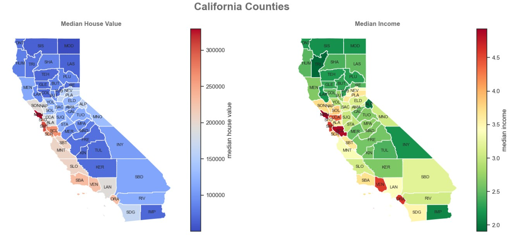
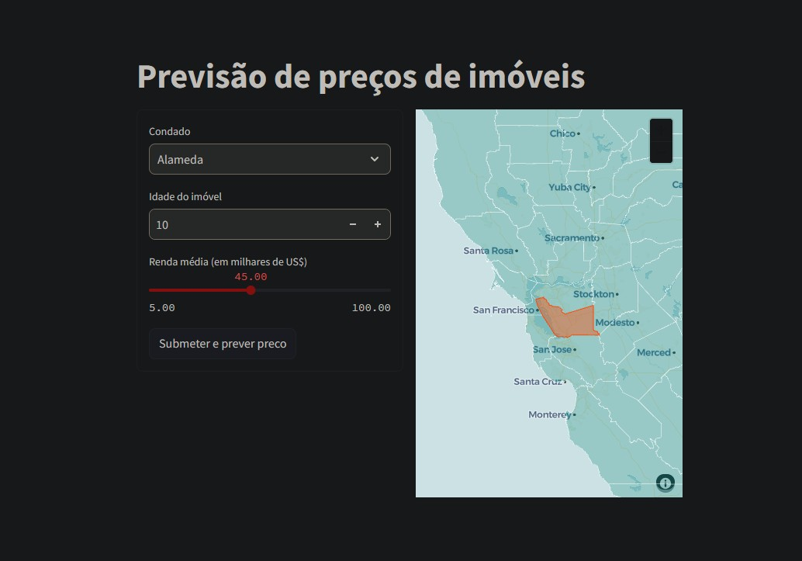

Photo by KEHN HERMANO: https://www.pexels.com/photo/city-skyline-during-golden-hour-3584437/

# Modelo de regressão para previsão de preços de imóveis no Estado da Califórnia

Modelo preditivo para estimar valores de imóveis nos condados da Califórnia, tendo como base dados derivados do censo dos EUA de 1990. Os dados são agrupados em blocos censitários. Um grupo de blocos é a menor unidade geográfica para a qual o Escritório do Censo dos EUA publica dados amostrais (um grupo de blocos geralmente tem uma população de 600 a 3.000 pessoas).

A análise exploratória foi dividida em duas etapas:

1 - Tratamento dos dados: Remoção de valores nulos, tratamento de outliers e criação de novas variáveis com base nas existentes, buscando uma melhor correlação com a variável target.

2 - Análise geográfica: Utilização de bibliotecas como seaborn, folium e geopandas para criar mapas e gráficos que facilitam o entendimento e a comparação dos dados.



A construção do modelo foi feita gradualmente:

* Análise inicial: Uma análise simples para nortear a construção do modelo.

* Preprocessamento: Aprofundamento no tratamento dos dados.

* Features polinomiais: Teste de features polinomiais para capturar relações não lineares.

* ElasticNet: Uso do ElasticNet para buscar uma solução melhor em relação aos coeficientes.

* Ridge Regression: Escolha final do modelo Ridge como a melhor alternativa.

A escolha final do modelo foi baseada em métricas como RMSE (Root Mean Squared Error) e R² (coeficiente de determinação), garantindo um equilíbrio entre viés e variância para previsões mais precisas.

A aplicação do modelo para a previsão de valores foi feita através do Streamlit, tornando o processo mais simples e intuitivo. O app solicita apenas a inserção do condado, idade do imóvel e renda média da região. Além disso, o app permite a visualização da região em um mapa.

['Previsão de preços de imóveis'](https://exemplocalifornia-fbps.streamlit.app/)



Clique no botão **Use this template** para criar um novo repositório com base neste modelo.

## Organização do projeto

```

├── .gitignore         <- Arquivos e diretórios a serem ignorados pelo Git
├── ambiente.yml       <- O arquivo de requisitos para reproduzir o ambiente de análise
├── requirements.txt   <- O arquivo para instalar dependências via pip
├── LICENSE            <- Licença de código aberto se uma for escolhida
├── README.md          <- README principal para desenvolvedores que usam este projeto.
|
├── dados              <- Arquivos de dados para o projeto.
|
├── modelos            <- Modelos treinados e serializados, previsões de modelos ou resumos de modelos
|
├── notebooks          <- Cadernos Jupyter. A convenção de nomenclatura é um número (para ordenação),
│                         as iniciais do criador e uma descrição curta separada por `-`, por exemplo
│                         `01-fb-exploracao-inicial-de-dados`.
│
|   └──src             <- Código-fonte para uso neste projeto.
|      │
|      ├── __init__.py  <- Torna um módulo Python
|      ├── auxiliares.py<- Funções auxiliares do projeto
|      ├── config.py    <- Configurações básicas do projeto
|      ├── graficos.py  <- Scripts para criar visualizações exploratórias e orientadas a resultados
|      └── modelos.py   <- Funções utilizadas no modelo
|
├── referencias        <- Dicionários de dados, manuais e todos os outros materiais explicativos.
|
├── relatorios         <- Análises geradas em HTML, PDF, LaTeX, etc.
│   └── imagens        <- Gráficos e figuras gerados para serem usados em relatórios
```

## Configuração do ambiente

1. Faça o clone do repositório que será criado a partir deste modelo.

    ```bash
    git clone ENDERECO_DO_REPOSITORIO
    ```

2. Crie um ambiente virtual para o seu projeto utilizando o gerenciador de ambientes de sua preferência.

    a. Caso esteja utilizando o `conda`, exporte as dependências do ambiente para o arquivo `ambiente.yml`:

      ```bash
      conda env export > ambiente.yml
      ```

    b. Caso esteja utilizando outro gerenciador de ambientes, exporte as dependências
    para o arquivo `requirements.txt` ou outro formato de sua preferência. Adicione o
    arquivo ao controle de versão, removendo o arquivo `ambiente.yml`.

3. Verifique o arquivo `notebooks/01-fb-exemplo.ipynb` para exemplos
de uso do código.
4. Renomeie o arquivo `notebooks/01-fb-exemplo.ipynb` para um nome
mais apropriado ao seu projeto. E siga a convenção de nomenclatura para os demais
notebooks.
5. Remova arquivos de exemplo e adicione os arquivos de dados e notebooks do seu
projeto.
6. Verifique o arquivo `notebooks/src/config.py` para configurações básicas do projeto.
Modifique conforme necessário, adicionando ou removendo caminhos de arquivos e
diretórios.
7. Atualize o arquivo `referencias/01_dicionario_de_dados.md` com o dicionário de dados
do seu projeto.
8. Atualize o `README.md` com informações sobre o seu projeto.
9. Adicione uma licença ao projeto. Clique
[aqui](https://docs.github.com/pt/repositories/managing-your-repositorys-settings-and-features/customizing-your-repository/licensing-a-repository)
se precisar de ajuda para escolher uma licença.
10. Renomeie o arquivo `.env.exemplo` para `.env`
11. Adicione variáveis de ambiente sensíveis ao arquivo `.env`.

Por padrão, o arquivo `.gitignore` já está configurado para ignorar arquivos de dados e
arquivos de Notebook (para aqueles que usam ferramentas como
[Jupytext](https://jupytext.readthedocs.io/en/latest/) e similares). Adicione ou remova
outros arquivos e diretórios do `.gitignore` conforme necessário. Caso deseje adicionar
forçadamente um Notebook ao controle de versão, faça um commit forçado com o
comando `git add --force NOME_DO_ARQUIVO.ipynb`.

Para mais informações sobre como usar Git e GitHub, [clique aqui](https://cienciaprogramada.com.br/2021/09/guia-definitivo-git-github/). Sobre ambientes virtuais, [clique aqui](https://cienciaprogramada.com.br/2020/08/ambiente-virtual-projeto-python/).
